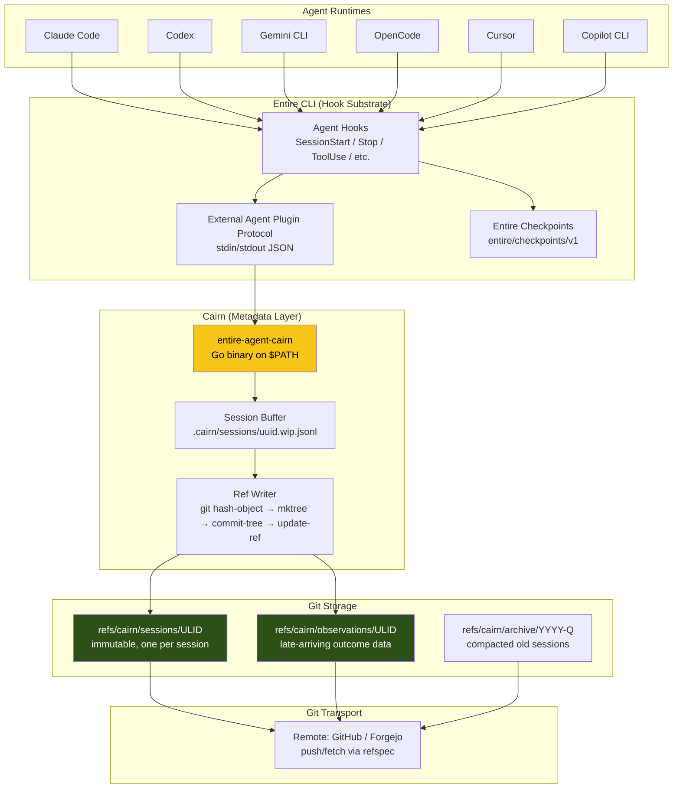
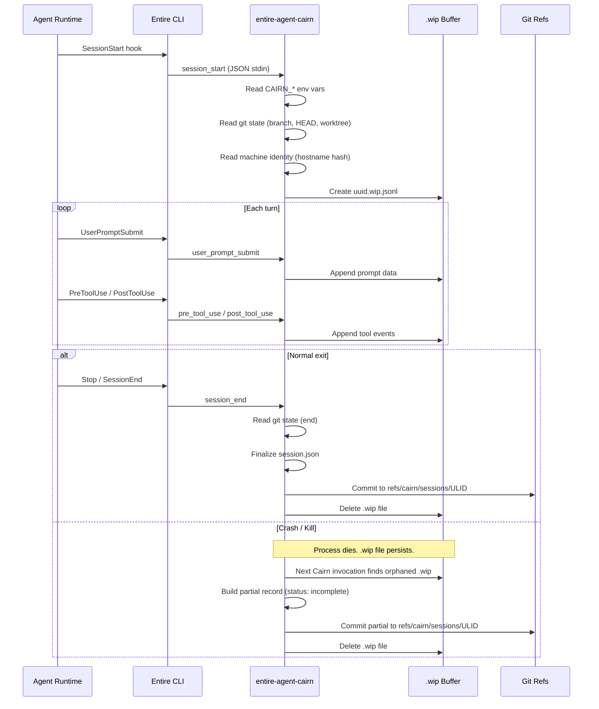
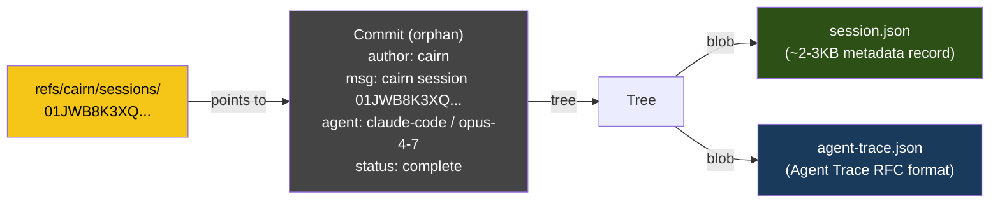
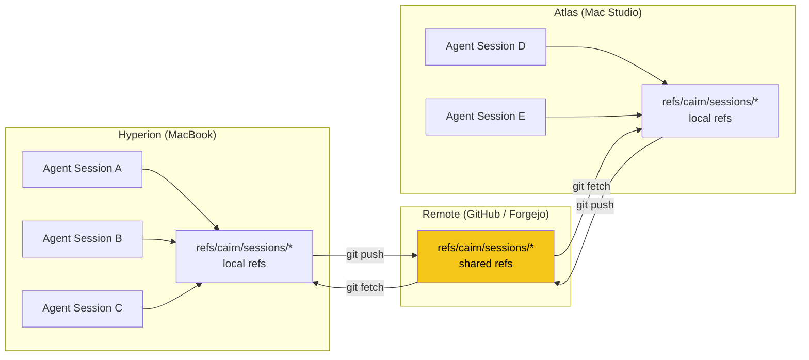
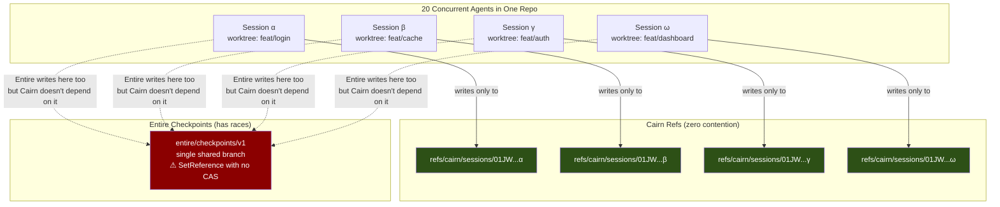
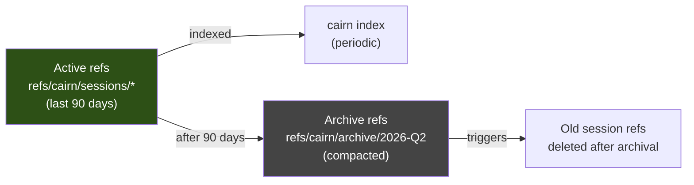
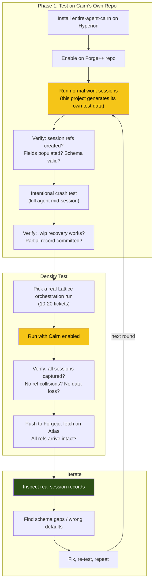

# Cairn: The Complete Plan

## What Cairn Is

Cairn captures flat metadata about every AI agent session in a repository and stores it as immutable git refs that travel with push/fetch. Built on top of Entire CLI's hook infrastructure. Designed for 60-80+ concurrent agents across multiple machines.

## Architecture Overview



## Data Flow: Session Lifecycle



## Git Object Model



Each session ref is an **orphan commit** — no parent, no DAG, no merge conflicts, no contention. 60 concurrent agents each write to a different ref name. Zero possibility of collision.

## Session Record Shape

```mermaid
graph TD
    S["session.json"]

    S --> ID["Identity<br/>schema_version, session_id,<br/>parent_session_id, status, exit_reason"]
    S --> AG["Agent<br/>runtime, model, version"]
    S --> PR["Prompt<br/>text, source, truncated"]
    S --> OR["Orchestration<br/>type, dispatch_method, ticket_id,<br/>run_id, role, workflow_version, extra{}"]
    S --> TI["Timing<br/>started_at, ended_at, duration_ms"]
    S --> MA["Machine<br/>hostname_hash, os, arch"]
    S --> OP["Operator<br/>git_user, os_user"]
    S --> GS["Git State<br/>start{branch, HEAD, worktree}<br/>end{branch, HEAD, commits[]}"]
    S --> OC["Outcome (observed)<br/>commits[], pr_number, pr_state, ci_status"]
    S --> FT["Files Touched<br/>[{path, action}]"]
    S --> TK["Tokens<br/>input, output, cache_read,<br/>cache_write, api_calls, cost_usd"]
    S --> TU["Tool Use<br/>total_calls, by_tool{}"]
    S --> TR["Transcript Ref<br/>entire_checkpoint_id, local_path"]
    S --> C1["c11 Context<br/>workspace_id, surface_id,<br/>tab_title, pane_lineage"]

    style S fill:#F5C518,color:#000
    style OR fill:#1a3a5c,color:#fff
    style C1 fill:#5c1a3a,color:#fff
```



## Orchestration Declaration

```mermaid
graph LR
    subgraph "Orchestrator sets env vars"
        L[Lattice Orchestrator]
        M[Manual Session]
        C[Custom Orchestrator]
    end

    subgraph "CAIRN_* Environment"
        E1[CAIRN_ORCHESTRATOR_TYPE]
        E2[CAIRN_DISPATCH_METHOD]
        E3[CAIRN_TICKET_ID]
        E4[CAIRN_RUN_ID]
        E5[CAIRN_PARENT_SESSION_ID]
        E6[CAIRN_AGENT_ROLE]
        E7[CAIRN_WORKFLOW_VERSION]
        E8[CAIRN_ORCHESTRATION_EXTRA]
    end

    subgraph "Cairn reads at session start"
        CA[entire-agent-cairn]
        OB[orchestration{} block<br/>in session.json]
    end

    L -->|exports all| E1 & E2 & E3 & E4 & E5 & E6 & E7 & E8
    M -->|exports nothing| CA
    C -->|exports subset| E1 & E3

    E1 & E2 & E3 & E4 & E5 & E6 & E7 & E8 --> CA
    CA -->|populates| OB

    style L fill:#F5C518,color:#000
    style CA fill:#F5C518,color:#000
```

When all env vars are absent → `orchestration.type = "manual"`. No inference, no analysis. Pure capture.

## Cross-Machine Sync



Sessions captured on Hyperion are visible on Atlas after the next fetch. No external sync, no database, no cloud service.

## Concurrency Model



## Ref Lifecycle



At 60 sessions/day → ~22,000 refs/year. After indexing, refs older than 90 days are compacted into quarterly archive commits. New clones fetch only recent refs by default.

## Implementation Phases

```mermaid
gantt
    title Cairn Implementation
    dateFormat YYYY-MM-DD
    axisFormat %b %d

    section Phase 0 (done)
    Remote ref validation       :done, p0a, 2026-05-26, 1d
    Entire plugin protocol map  :done, p0b, 2026-05-26, 1d
    Python PoC binary           :done, p0c, 2026-05-26, 1d

    section Phase 1: Capture
    Go binary: entire-agent-cairn  :active, p1a, 2026-05-27, 5d
    Session buffer + crash recovery :p1b, after p1a, 3d
    Ref writer (git plumbing)       :p1c, after p1a, 3d
    Density test (20 agents)        :p1d, after p1b, 2d
    Cross-machine test (Hyperion ↔ Atlas) :p1e, after p1d, 1d

    section Phase 2: Query
    cairn query CLI              :p2a, after p1e, 3d
    cairn index                  :p2b, after p2a, 3d

    section Phase 3: Emit + Integrate
    Agent Trace emission         :p3a, after p2b, 2d
    Lattice skill update (CAIRN_* vars) :p3b, after p1e, 1d
```

## Testing Strategy



**Key insight: Cairn tests itself.** The work we're doing right now on this project (Forge++/Cairn design sessions) generates real agent sessions. Once `entire-agent-cairn` is installed, every session in this repo becomes test data. The first test is: does the binary we just built capture the session where we built it?

After solo sessions work, the density test is a real Lattice orchestration run — not synthetic data, not a contrived scenario, but actual multi-agent work producing PRs. If Cairn survives a real 10-20 ticket dispatch, it works.

## What We're Not Building

```mermaid
graph TD
    CAIRN["Cairn<br/>(capture + store)"]

    NO1["❌ Analysis engine"]
    NO2["❌ Hierarchical workflow model"]
    NO3["❌ Outcome binding / correlation"]
    NO4["❌ Dashboard"]
    NO5["❌ Hook infrastructure<br/>(Entire does this)"]

    CAIRN -.->|not building| NO1 & NO2 & NO3 & NO4 & NO5

    YES1["✓ Flat metadata per session"]
    YES2["✓ Immutable git refs"]
    YES3["✓ Concurrent-safe at 60+ agents"]
    YES4["✓ Cross-machine via push/fetch"]
    YES5["✓ Agent Trace interop"]

    CAIRN -->|building| YES1 & YES2 & YES3 & YES4 & YES5

    style CAIRN fill:#F5C518,color:#000
    style NO1 fill:#8b0000,color:#fff
    style NO2 fill:#8b0000,color:#fff
    style NO3 fill:#8b0000,color:#fff
    style NO4 fill:#8b0000,color:#fff
    style NO5 fill:#8b0000,color:#fff
    style YES1 fill:#2d5016,color:#fff
    style YES2 fill:#2d5016,color:#fff
    style YES3 fill:#2d5016,color:#fff
    style YES4 fill:#2d5016,color:#fff
    style YES5 fill:#2d5016,color:#fff
```


